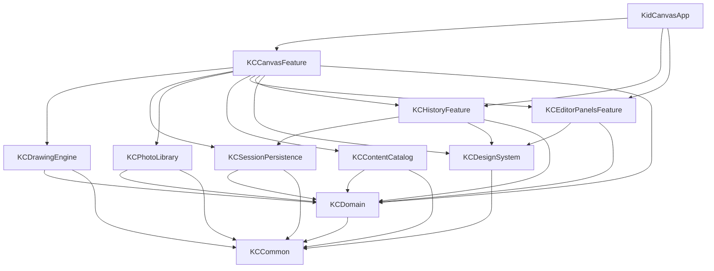

# KidCanvas 模块化架构设计文档

## 1. 文档目标

本文档定义 KidCanvas 在 Swift 主线下的模块化架构方案，目标是：

- 通过 SPM 管理本地业务模块与基础能力模块。
- 对项目进行分级分层，明确职责边界和依赖方向。
- 支撑当前 Objective-C 原型迁移到 Swift-first 架构。
- 避免单控制器、单目录、强耦合代码继续扩张。
- 为后续多人协作、并行开发、测试和持续演进提供结构基础。

本文档重点解决的是“工程如何组织”，不是“某个功能怎么实现”。

## 2. 架构结论

KidCanvas 应采用：

```text
App 壳工程 + 本地 SPM 聚合包 + 多 target 模块 + 分层依赖约束
```

不建议采用以下方式：

- 单 target 扁平目录继续增长。
- 一个业务模块一个独立 package。
- 纯 SwiftUI 画布。
- 先做大量页面，再回头补架构边界。

推荐方案是：

- 使用 1 个本地聚合 SPM package 管理多个模块 target。
- 模块按职责划分，而不是按文件类型划分。
- 依赖方向严格单向。
- 画布核心保留为 Swift + UIKit/Core Graphics 模块。
- 外围面板优先使用 SwiftUI。

### 2.1 当前落地状态（2026-07-06）

当前 App target 已无业务 Objective-C `.m` 源码，当前工程已无 `KidCanvas-Bridging-Header.h`，历史 bridge 方案只作为迁移记录保留，不再作为当前实现路径。

当前 SPM 落地形态是 1 个本地 package、5 个基础 library target：`KCCommon`、`KCDomain`、`KCDrawingEngine`、`KCContentCatalog`、`KCSessionPersistence`。App target 已按 App / Features / Infrastructure / DesignSystem / Localization / Resources 分层；App Feature 仍在 App target 内，待边界稳定后再评估下沉到 `Packages/KidCanvasModules` 的独立 target。

产品继续支持 iPhone + iPad，横屏优先。架构治理上禁止一个模块一个 package，禁止把画布核心重写为纯 SwiftUI Canvas；画布仍以 Swift UIKit/Core Graphics 为主，外围面板可在边界稳定后按需 SwiftUI 化。

## 3. 当前项目问题

当前工程已经完成 Swift-first 基线迁移，但仍处在模块边界继续收敛阶段，主要问题如下：

### 3.1 工程层面已建立基础模块，Feature 仍在渐进拆分

- 当前已有 1 个 App target。
- 当前已有 `Packages/KidCanvasModules` 单一本地 SPM package。
- 当前已有 5 个基础 library target。
- App 层 Feature 仍以 App target 内的 Swift 类型承载，并已按职责目录分组；后续按稳定边界继续下沉。

### 3.2 App 目录仍需继续分层

当前 App 层 Swift 文件仍主要直接放在 `KidCanvas/` 目录下，属于迁移期扁平结构：

- 启动代码
- 主页面
- 画布引擎
- 会话模型
- 本地存储

App 层文件还没有形成清晰子目录，工程边界主要由类型和文档先行约束。

### 3.3 控制器职责过重

`KCMainViewController` 仍承担较多页面协调职责：

- 页面布局
- 工具状态管理
- 颜色面板
- 尺寸面板
- 历史面板
- 线稿选择
- 相册导入导出
- 会话保存
- 草稿恢复

这会导致：

- 修改风险大
- 测试边界模糊
- 难以并行开发
- SwiftUI 迁移困难

### 3.4 资源和内容硬编码

当前色盘、贴纸、线稿主要通过代码维护，后续扩展成本高，且无法形成独立内容模块。

## 4. 设计原则

本架构遵循以下原则：

### 4.1 单一职责

每个模块只解决一类问题，不同时承担 UI、状态、存储、系统能力。

### 4.2 单向依赖

依赖只能从上层流向下层，禁止反向引用。

### 4.3 模块先于页面

先拆出稳定的模块边界，再做 Swift 重写和页面迁移。

### 4.4 target 先于 package

先通过 SPM target 建立模块边界，只有当模块需要独立复用、独立版本管理时，才升级成独立 package。

### 4.5 画布内核稳定优先

绘图、填色、取色、贴纸、撤销重做等核心能力优先保留在 UIKit/Core Graphics 体系中，不为了“纯 SwiftUI”牺牲可控性。

## 5. 分级分层设计

KidCanvas 采用四级架构：

```text
L1 App 壳层
L2 Feature 业务层
L3 Core / Infrastructure 能力层
L4 Domain 基础业务层
```

依赖方向：

```text
App -> Feature -> Core/Infra -> Domain -> Common
```

### 5.1 App 壳层

职责：

- 启动应用
- Scene 生命周期
- 模块装配
- 根路由
- 全局环境注入

不负责：

- 具体业务逻辑
- 画布实现
- 数据存储细节
- 具体页面状态处理

模块装配现状（T016/T021/T036）：App 壳层的 Composition Root `KCAppCompositionRoot` 集中装配 App 级依赖并通过构造注入交给使用方，目前装配：

- 会话服务 `KCSessionService`（Swift `KCSessionStore` + 旧 archive 迁移器）
- 内容目录 `KCBundledContentCatalog`（色盘 / 贴纸分组 / 线稿模板的单一来源，详见 `docs/modules/KCContentCatalog.md`）
- 绘制能力 `KCDrawingEngineProviding`（默认实现 `KCDrawingEngineAdapter`，负责 UIKit 类型与 `KCDrawingEngine` / `KCDomain` 纯 Swift 能力之间的适配）

`SceneDelegate` 经 `KCAppCompositionRoot.makeMainViewController()` 创建主控制器，`KCMainViewController(sessionService:contentCatalog:drawingEngine:)` 接收已构造好的依赖，不在控制器内部重新装配或硬编码内容。后续业务模块（用户、付费）演进时，在此处统一装配。

### 5.2 Feature 业务层

职责：

- 面向用户能力组织页面和交互流程
- 组合多个核心模块完成业务场景
- 提供页面状态驱动与交互事件处理

这一层通常按功能拆分，例如：

- 画布编辑
- 历史会话
- 编辑器面板

Feature 拆分进度（App 层 Feature 类型 + KCDomain 纯逻辑）：

- **T022 `KCContentPickerFeature`（App 层）**：从 `KCMainViewController` 抽出，集中持有色盘（24/36 切换）、最近色（UserDefaults）、贴纸分类选择的状态与决策；`KCMainViewController` 持有其 lazy 实例 `contentPicker` 并委托。纯逻辑下沉到 KCDomain：`KCContentPickerLayout`（色盘网格几何）、`KCRecentColorQueue`（最近色去重/裁剪）、`KCStickerCategoryMapping`（分类↔符号↔无障碍标签↔ slug 解析），均有单测。T027 后，自定义颜色区域只保留一个明确入口（`customColorButton`，用于打开 `UIColorPickerViewController` 并作为 iPad popover 锚点），最近色独立放在横向 `recentColorRowStack`，不再使用平铺彩虹图或重复色环作为装饰。T049 后，颜色面板 UIKit 创建、色盘按钮、最近色按钮、分段按钮样式和当前色高亮由 `KCColorPalettePanelRenderer` 承接，`KCContentPickerFeature` 继续只负责状态和内容决策。
- **T023 `KCEditorPanelsFeature`（App 层）**：从 `KCMainViewController` 抽出，持有浮动工具面板「收起/展开」状态与折叠态工具芯片色块决策；`KCMainViewController` 持有 lazy 实例 `editorPanels`，`applyPanelsCollapsedAnimated` 与 `refreshToolStateChip` 改为读 `editorPanels.collapseState` / `chipSwatchColor`。纯折叠态决策（图标/标签/各视图 alpha·hidden·enabled）下沉 KCDomain `KCEditorPanelsCollapseState`（有单测）。折叠动画、五组浮动面板视图本身、工具/画笔/颜色事件协调仍留控制器。
- **T024 `KCHistoryFeature`（App 层）**：从 `KCMainViewController.refreshHistoryUI()` 抽出，集中历史缩略图槽位状态推导（空/普通/当前/选中/脏态）与「删除历史」可用性判定；`KCMainViewController` 持有 lazy 实例 `history`，`refreshHistoryUI` 改为每格 `history.thumbStatus(...)` + `borderColor(for:)`。纯槽位状态判定（优先级 + 边框宽 + 强调缩放 + 无障碍前缀）下沉 KCDomain `KCHistoryThumbStatus`（有单测），分页仍走 T013 `KCHistoryPaging`。历史会话数据、缩略图按钮构建、打开/删除/翻页事件协调仍留控制器；不触碰 session 持久化磁盘格式。
- **T039 `KCLineArtFeature`（App 层）**：从 `KCMainViewController` 抽出线稿 item 组装、缩略图渲染和画布线稿图片渲染；`KCMainViewController` 持有 lazy 实例 `lineArtFeature`，仅保留线稿弹窗、按钮点击和替换画布的页面协调。线稿元数据仍由 `KCContentCatalog` 提供，几何仍由 `KCDrawingEngine` 提供，Feature 只负责 App 层编排。
- **T047 `KCLineArtPickerViewController`（App 层）**：从 `KCMainViewController.didTapLineArtPicker()` 抽出线稿选择弹窗的 UIKit 网格、滚动容器、预览按钮和点击回调；主控制器只保留 popover 锚点、dismiss 后调用 `loadLineArtItem(_:)` 的页面协调。
- **T040 `KCDeviceLayoutMetrics`（App 层）**：从 `KCMainViewController` 抽出设备布局尺寸决策，集中 iPhone/iPad 的右侧面板、底部工具坞、画笔卡片、历史缩略图等指标；控制器暂保留同名方法作薄转发，实际尺寸来源改为 `layoutMetrics`。
- **T041 `KCEditorUIFactory`（App 层）**：从 `KCMainViewController` 抽出浮动面板、图标按钮、小工具按钮、分段按钮、历史缩略图按钮、画笔卡片等通用 UIKit 控件样式创建；控制器仍保留事件 target、按压反馈注册和面板业务组装。
- **T042 `KCBrushDockFeature`（App 层）**：从 `KCMainViewController.buildBottomDock(_:)` 抽出底部画笔项配置、SF Symbol、本地化标题和强调色决策；控制器仍保留按钮创建、target/action、无障碍标识和工具状态协调。
- **T043 `KCBrushDockFeature` 扩展（App 层）**：继续从 `KCMainViewController.refreshBrushDockSelection()` 抽出底部画笔 Dock 的按钮匹配判断和选中态样式；控制器只负责遍历按钮、调用 Feature 和滚动到当前按钮。
- **T044 `KCEraserControlsFeature`（App 层）**：从 `KCMainViewController` 抽出橡皮擦尺寸预览路径和 circle/cloud/star 形状按钮选中态；真实擦除路径仍由 `KCDrawingEngine` 提供，Feature 只负责控件预览与按钮外观。
- **T046 `KCToolRailFeature`（App 层）**：从 `KCMainViewController.buildLeftRail(_:)` / `selectToolMode(_:)` 抽出左侧工具栏工具项配置、取色器强调色、按钮匹配判断和选中态样式；控制器只负责创建按钮、绑定事件和协调画布工具状态。
- **T048 `KCPressFeedbackController`（App 层）**：从 `KCMainViewController` 抽出通用按钮按压反馈注册、原始 transform/alpha 记录和释放恢复动画；控制器只保留注册入口，不再直接维护 associated-object 状态。
- **T048 `KCToastPresenter`（App 层）**：从 `KCMainViewController.showSaveToastWithSuccess(_:)` 抽出保存成功 / 失败 Toast 的视图创建、图标、约束、展示和自动消失动画；控制器仍负责保存语义、相册写入、历史保存与草稿清理。
- **T049 `KCColorPalettePanelRenderer`（App 层）**：从 `KCMainViewController.buildColorsPanel(_:)`、`reloadPaletteGrid()`、`reloadRecentColorRow()`、`updatePaletteButtons()` 和 `selectColor(_:sender:)` 抽出颜色面板 UIKit 渲染与当前色高亮；控制器只保留颜色选择事件、当前画布颜色写入、最近色持久化调用和自定义颜色 popover 展示。
- **T050 `KCBrushStickerPanelView`（App 层）**：从 `KCMainViewController.buildSizePanel(_:)`、`reloadStickerButtons()`、`refreshStickerCategoryButtons()` 和 `refreshStickerEditButtons()` 抽出画笔/贴纸/橡皮/贴纸编辑面板的 UIKit 组装与按钮表现；控制器仍负责事件 selector、画布状态、当前贴纸选择、橡皮真实路径、贴纸手势和 undo/redo。
- **T013 `KCHistoryPaging`、T017 `KCToolStateChipTitle`（KCDomain）**：更早的最小边界抽取。

### 5.3 Core / Infrastructure 能力层

职责：

- 封装具体技术能力
- 对系统框架和底层能力做隔离
- 为业务层提供稳定服务

例如：

- 绘图引擎
- 本地持久化
- 相册适配
- 内容目录
- 设计系统

### 5.4 Domain 基础业务层

职责：

- 定义纯业务模型
- 定义仓储协议
- 定义编辑器状态与工具类型
- 不依赖具体 UI 技术

这一层应尽量保持纯 Swift 业务语义，不依赖 UIKit、SwiftUI、Photos。

## 6. 模块划分

第一阶段推荐 1 个本地聚合 package：`KidCanvasModules`

在该 package 中定义多个 target。

### 6.1 模块总览

| 模块名 | 层级 | 职责 |
| --- | --- | --- |
| `KCCommon` | 基础层 | 公共工具、通用类型、错误、日志、配置 |
| `KCDomain` | Domain | 业务模型、协议、状态定义 |
| `KCDesignSystem` | Core | 设计系统与通用 UI 样式 |
| `KCDrawingEngine` | Core | 画布、绘图、填色、取色、贴纸、撤销重做 |
| `KCSessionPersistence` | Infra | 本地会话存储、缩略图、草稿、元数据 |
| `KCPhotoLibrary` | Infra | 相册导入导出和权限适配 |
| `KCContentCatalog` | Infra | 线稿、贴纸、调色板等资源目录 |
| `KCEditorPanelsFeature` | Feature | 工具、颜色、尺寸、贴纸、线稿面板 |
| `KCContentPickerFeature` | Feature | 色盘、最近色与贴纸分类状态决策 |
| `KCHistoryFeature` | Feature | 历史会话与草稿入口 |
| `KCCanvasFeature` | Feature | 主画布业务编排 |
| `KCLineArtFeature` | Feature | 线稿列表、缩略图与画布线稿渲染编排 |
| `KCLineArtPickerViewController` | Feature | 线稿选择弹窗 UIKit 展示与选择回调 |
| `KCDeviceLayoutMetrics` | Feature | iPhone/iPad 布局指标与尺寸决策 |
| `KCEditorUIFactory` | Feature | 编辑器通用 UIKit 控件样式创建 |
| `KCBrushDockFeature` | Feature | 底部画笔 Dock 配置、强调色与选中态决策 |
| `KCEraserControlsFeature` | Feature | 橡皮擦预览路径与形状按钮选中态 |
| `KCToolRailFeature` | Feature | 左侧工具栏配置、强调色与选中态决策 |
| `KCPressFeedbackController` | Feature | 通用按钮按压反馈注册与动画 |
| `KCToastPresenter` | Feature | 保存成功 / 失败 Toast 展示与消失动画 |
| `KCColorPalettePanelRenderer` | Feature | 颜色面板 UIKit 渲染与当前色高亮 |
| `KCBrushStickerPanelView` | Feature | 画笔、贴纸、橡皮与贴纸编辑面板组装 |
| `KidCanvasApp` | App | 启动、装配、依赖注入 |

模块文档基线（T051）：`docs/modules/` 已覆盖 `KCCommon`、`KCDomain`、`KCSessionPersistence`、`KCContentPickerFeature`、`KCEditorPanelsFeature`、`KCHistoryFeature` 以及当前 App 层表现组件。每篇文档至少记录职责、边界、对外 API / 接入路径和禁止回流规则；`scripts/validate_project.py` 会校验这些基线文档存在并出现在模块索引中。

模块治理校验（T052/T053/T054）：`scripts/validate_project.py` 已纳入单一本地 SPM package、多基础 target、测试 target 对齐、基础模块依赖方向、AppleDouble 元数据禁入和架构现实状态校验。后续新增模块或调整依赖时，必须先更新模块文档与架构文档，再让 validator 通过。

### 6.2 `KCCommon`

职责：

- 公共工具函数
- 通用错误类型
- 日志协议
- 基础配置
- 与业务无关的小型可复用组件

约束：

- 不放业务模型
- 不放页面逻辑
- 不依赖 Feature

### 6.3 `KCDomain`

职责：

- `ArtworkSession`
- `ToolMode`
- `BrushStyle`
- `EraserShape`
- `StickerItem`
- `LineArtTemplate`
- `EditorState`
- 仓储协议
- 相册服务协议

约束：

- 不依赖 UIKit
- 不依赖 SwiftUI
- 不依赖 Photos

### 6.4 `KCDesignSystem`

职责：

- 颜色规范
- 间距与圆角
- 通用按钮样式
- 面板外观
- 图标与字体映射
- 可复用 UI 组件

目标：

- 统一视觉风格
- 降低 Feature 自行拼 UI 的重复代码

### 6.5 `KCDrawingEngine`

职责：

- `DrawingCanvasView`
- stroke 模型
- sticker 模型
- canvas state
- flood fill
- color sampler
- snapshot / restore
- undo / redo

实现建议：

- 使用 Swift + UIKit `UIView`
- 使用 Core Graphics / bitmap context
- 将算法逻辑从 view 中继续拆出

它是系统最重要的技术内核，必须保持低耦合和高可测试性。

### 6.6 `KCSessionPersistence`

职责：

- 保存原图
- 生成缩略图
- 保存 metadata
- 保存 draft
- 删除和读取历史会话
- 处理 schema version

实现建议：

- `Codable + JSON` 维护元数据
- 文件系统保存图片文件
- 保留失败回滚策略

### 6.7 `KCPhotoLibrary`

职责：

- 导入相册图片
- 导出图片到相册
- 权限检查与错误包装

价值：

- 将系统框架与业务逻辑隔离
- 减少 Feature 层直接接触 `UIImagePickerController` / Photos 细节

### 6.8 `KCContentCatalog`

职责：

- 贴纸资源索引
- 线稿资源索引
- 调色板数据
- 类别与配置解析

资源建议：

- 使用 package 资源管理
- 通过 JSON + asset catalog / pdf / png 管理内容

实现现状（T020/T021/T037）：

- 色盘、贴纸分组与线稿模板的**元数据**外置为 package resource `Resources/content.json`，由 `KCContentCatalogDefaults.decodedContent(from:)` 解码；JSON 缺失、损坏或色盘数量不完整时回退到逐字一致的硬编码 `Fallback`。
- 调色板（24/36 色）以 `KCHexColor` 形式从 JSON 解码，`palette.36` 的前 24 色必须与 `palette.24` 一致。
- 打包入口 `KCBundledContentCatalog`（Sendable）一次性暴露色盘 + 贴纸分组 + 线稿模板，供 App 层注入；默认构造走无 IO fallback，避免启动阶段读取 package resource，资源文件校验通过 `resourceBacked()` 显式触发。
- App 主路径通过 `KCAppCompositionRoot` 装配 `KCBundledContentCatalog` 并构造注入 `KCMainViewController`；控制器据此派生色盘、贴纸分类等内容状态，不再硬编码这些内容。线稿顺序与标题由 `KCLineArtFeature` 消费 catalog 生成，程序化几何由 `KCDrawingEngine.KCLineArtDrawing` 提供，App adapter 只负责把 `CGPath` 包装为 `UIBezierPath` 并交给调用方描边闭包。
- 详见 `docs/modules/KCContentCatalog.md`。

### 6.9 `KCEditorPanelsFeature`

职责：

- 工具栏
- 颜色面板
- 尺寸面板
- 贴纸面板
- 线稿选择面板

实现建议：

- 优先 SwiftUI
- 对绘图引擎只通过状态和 action 协议交互

### 6.10 `KCHistoryFeature`

职责：

- 历史会话列表
- 草稿入口
- 删除确认
- 恢复编辑

依赖：

- `KCSessionPersistence`
- `KCDomain`
- `KCDesignSystem`

### 6.11 `KCCanvasFeature`

当前状态：已建立 App 层最小边界。

已承接职责：

- 创建并配置 `KCDrawingCanvasView`
- 输出 undo / redo / save 按钮可用性的 `ActionState`
- 应用 undo / redo / save 动作按钮 enabled、alpha、背景色和 save tint 外观
- 封装画布是否有可保存内容的判断
- 封装贴纸默认 symbol fallback
- 封装当前填充色读取

暂不承接职责：

- 触摸绘制、撤销栈、贴纸手势与 Core Graphics 绘制仍留在 `KCDrawingCanvasView`
- 保存、草稿、历史、相册导入导出仍由 `KCMainViewController` 协调
- 线稿程序化绘制几何已迁入 `KCDrawingEngine`，线稿 item、缩略图和画布图片渲染由 `KCLineArtFeature` 承接

演进原则：`KCCanvasFeature` 是主画布 Feature 的聚合入口，但不重新实现底层绘制能力；控制器可以逐步把“状态决策”和“依赖装配”迁入 Feature，视觉和运行行为必须保持 iPhone + iPad 双端稳定。

## 7. SPM 组织方案

### 7.1 为什么不是一个模块一个 package

不建议“一个模块一个独立 package”，原因：

- 初期模块边界尚在演化
- Xcode 和工程维护成本会显著升高
- 独立 package 适合复用和版本管理，不适合项目早期的高频调整

因此第一阶段推荐：

```text
1 个本地 package
+ 多个 target 模块
```

### 7.2 推荐 package 结构

```text
Packages/
  KidCanvasModules/
    Package.swift
    Sources/
      KCCommon/
      KCDomain/
      KCDesignSystem/
      KCDrawingEngine/
      KCSessionPersistence/
      KCPhotoLibrary/
      KCContentCatalog/
      KCEditorPanelsFeature/
      KCContentPickerFeature/
      KCHistoryFeature/
      KCCanvasFeature/
      KCLineArtFeature/
      KCLineArtPickerViewController/
      KCDeviceLayoutMetrics/
      KCEditorUIFactory/
      KCBrushDockFeature/
      KCEraserControlsFeature/
      KCToolRailFeature/
      KCPressFeedbackController/
      KCToastPresenter/
      KCColorPalettePanelRenderer/
      KCBrushStickerPanelView/
    Tests/
      KCCommonTests/
      KCDomainTests/
      KCDrawingEngineTests/
      KCSessionPersistenceTests/
      KCContentCatalogTests/
```

### 7.3 App 工程结构

```text
App/
  KidCanvasApp.swift
  AppDelegate.swift
  SceneDelegate.swift
  CompositionRoot/
```

App 工程通过本地 package 引入各模块 target。

## 8. 依赖设计

### 8.1 模块依赖图



### 8.2 硬性依赖规则

- `KCCommon` 不依赖任何业务模块
- `KCDomain` 只能依赖 `KCCommon`
- `KCDesignSystem` 只能依赖 `KCCommon`
- `KCDrawingEngine` 只能依赖 `KCDomain`、`KCCommon`
- `KCSessionPersistence` 只能依赖 `KCDomain`、`KCCommon`
- `KCPhotoLibrary` 只能依赖 `KCDomain`、`KCCommon`
- `KCContentCatalog` 只能依赖 `KCDomain`、`KCCommon`
- `KCEditorPanelsFeature` 只能依赖 `KCDomain`、`KCDesignSystem`
- `KCHistoryFeature` 只能依赖 `KCDomain`、`KCDesignSystem`、`KCSessionPersistence`
- `KCCanvasFeature` 可以依赖其他业务和能力模块
- `KidCanvasApp` 只负责装配，不下沉业务逻辑

## 9. 当前代码到模块归属的映射

| 当前文件 | 当前归属 / 演进目标 |
| --- | --- |
| `AppDelegate.swift` / `SceneDelegate.swift` / `KCAppCompositionRoot.swift` | `KidCanvasApp` |
| `KCMainViewController.swift` | App 壳层页面协调，继续向 `KCCanvasFeature`、`KCEditorPanelsFeature`、`KCContentPickerFeature`、`KCHistoryFeature` 等 App Feature 收敛 |
| `KCDrawingCanvasView.swift` / `KCDrawingEngineAdapter.swift` | App 层 UIKit 画布与 `KCDrawingEngine` 适配 |
| `Packages/KidCanvasModules/Sources/KCDrawingEngine/` | `KCDrawingEngine` |
| `Packages/KidCanvasModules/Sources/KCDomain/` | `KCDomain` |
| `Packages/KidCanvasModules/Sources/KCSessionPersistence/` | `KCSessionPersistence` |
| `Packages/KidCanvasModules/Sources/KCContentCatalog/` | `KCContentCatalog` |
| 颜色、按钮、面板样式 | 当前 App Feature / `KCEditorUIFactory`，后续稳定后再评估 `KCDesignSystem` target |

## 10. 迁移步骤

### 阶段 1：建立模块骨架

- 创建 `Packages/KidCanvasModules/Package.swift`
- 创建各个 target 空模块
- App 工程接入本地 package
- 先不迁大逻辑，只验证编译链路

### 阶段 2：先迁基础和稳定模块

- `KCCommon`
- `KCDomain`
- `KCSessionPersistence`
- `KCContentCatalog`
- `KCPhotoLibrary`

优先迁这些模块的原因是边界清晰、依赖简单、利于先建立底座。

### 阶段 3：迁画布引擎

- 重写 `KCDrawingEngine`
- 拆分算法逻辑与视图逻辑
- 建立测试覆盖

### 阶段 4：迁 Feature

- 拆分主页面
- 建立 `KCEditorPanelsFeature`
- 建立 `KCHistoryFeature`
- 建立 `KCCanvasFeature`

### 阶段 5：收缩 App 壳层

- App 工程只保留启动与装配
- 删除旧 Objective-C 主线依赖
- 更新运行文档和协作流程

## 11. 测试策略

### 11.1 单元测试优先模块

- `KCDomain`
- `KCDrawingEngine` 中的算法模块
- `KCSessionPersistence`
- `KCContentCatalog`

### 11.2 UI / 集成测试重点

- 主画布启动
- 工具切换
- 历史会话恢复
- 相册导入导出
- 草稿恢复

### 11.3 模块化收益

模块边界建立后：

- 单测不需要拉起整个 App
- 并行开发冲突减少
- Feature 可单独演进
- 迁移 SwiftUI 面板更安全

## 12. 风险与约束

### 12.1 主要风险

- 模块边界切得过碎，导致维护成本高
- 迁移过早把画布塞进纯 SwiftUI，导致交互退化
- Feature 继续绕过模块边界直接访问底层细节
- 旧代码迁移时复制逻辑过多，形成“双实现长期共存”

### 12.2 约束

- 第一阶段不做一个模块一个独立 package
- 第一阶段不做多 target 产品拆分
- 第一阶段不做云同步、账号体系、社区分享
- 第一阶段不引入大型第三方架构框架

### 12.3 下一阶段暂缓技术债

| 技术债 | 当前决策 | 后续触发条件 | 验收口径 |
|:---|:---|:---|:---|
| `KCDrawingEngineAdapter` 实例化 / 协议化 / DI 化 | 已完成（T036）。App 通过 `KCDrawingEngineProviding` 协议依赖绘制能力，默认 adapter 由 Composition Root 注入 | 后续如出现多绘制实现或 mock 需求，在协议下扩展实现 | 保持 `KCDrawingEngineProviding` 协议、Composition Root 注入、双端构建与现有绘制测试通过 |
| 色盘 JSON 化 | 已完成（T037）。24/36 色盘已进入 `KCContentCatalog` package resource，App 启动默认消费 `KCBundledContentCatalog` fallback，资源校验显式使用 `resourceBacked()` | 需要运营配置、多语言色盘命名、或远端内容下发时，在现有 JSON schema 上扩展 | JSON 资源解析测试覆盖，fallback 与资源内容一致，颜色顺序与现有 UI 无回归 |
| 线稿绘制闭包迁移到 DrawingEngine | 已完成（T038）。线稿 id/title/order 仍由 `KCContentCatalog` 提供，几何由 `KCLineArtDrawing` 输出 `CGPath` 指令，App adapter 转成 UIKit 描边 | 后续如要新增线稿或调整视觉，在 DrawingEngine 内扩展并补视觉验收 | 线稿数量、id、顺序不变，DrawingEngine 单测、validator、双端构建与运行时烟测通过 |
| 继续拆 `KCMainViewController` | 持续推进，按最小边界拆分 | 控制器新增职责前，优先评估能否进入 Feature | validator 覆盖新边界，iPhone/iPad build 与 runtime smoke 通过 |

## 13. 最终建议

KidCanvas 的正确演进方向不是“先把 Objective-C 代码翻译成 Swift”，而是：

```text
先建立模块边界
再用 SPM 固化边界
再逐层迁移 Swift 实现
最后收缩 App 壳层
```

最推荐的落地方式：

- 1 个本地聚合 SPM package
- 多个清晰职责的 target 模块
- App target 只做装配
- UIKit/Core Graphics 负责画布核心
- SwiftUI 负责外围面板

这样既能满足你要的“模块区分、SPM 管理、分级分层”，也能保证这个绘画项目不会因为过度设计而失去推进速度。
