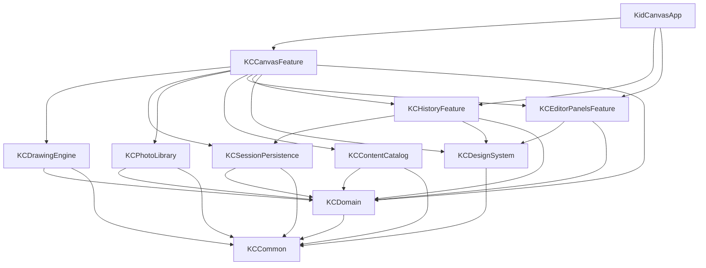

# KidCanvas 模块化架构设计文档

## 1. 文档目标

本文档定义 KidCanvas 在 Swift 主线下的模块化架构方案，目标是：

- 通过 SPM 管理本地业务模块与基础能力模块。
- 对项目进行分级分层，明确职责边界和依赖方向。
- 支撑当前 Objective-C 原型迁移到 Swift-first 架构。
- 避免单控制器、单目录、强耦合代码继续扩张。
- 为后续多人协作、并行开发、测试和持续演进提供结构基础。

本文档重点解决的是“工程如何组织”，不是“某个功能怎么实现”。

## 2. 架构结论

KidCanvas 应采用：

```text
App 壳工程 + 本地 SPM 聚合包 + 多 target 模块 + 分层依赖约束
```

不建议采用以下方式：

- 单 target 扁平目录继续增长。
- 一个业务模块一个独立 package。
- 纯 SwiftUI 画布。
- 先做大量页面，再回头补架构边界。

推荐方案是：

- 使用 1 个本地聚合 SPM package 管理多个模块 target。
- 模块按职责划分，而不是按文件类型划分。
- 依赖方向严格单向。
- 画布核心保留为 Swift + UIKit/Core Graphics 模块。
- 外围面板优先使用 SwiftUI。

## 3. 当前项目问题

当前工程是一个原型结构，主要问题如下：

### 3.1 工程层面没有模块

- 只有 1 个 Xcode target。
- 没有 SPM 本地模块。
- 没有 framework 层级。
- 没有 package 级资源管理。

### 3.2 目录层面没有分层

当前代码全部直接放在 `KidCanvas/` 目录下，属于扁平结构：

- 启动代码
- 主页面
- 画布引擎
- 会话模型
- 本地存储

都放在同一级，没有明确的工程边界。

### 3.3 控制器职责过重

`KDMainViewController` 同时承担：

- 页面布局
- 工具状态管理
- 颜色面板
- 尺寸面板
- 历史面板
- 线稿选择
- 相册导入导出
- 会话保存
- 草稿恢复

这会导致：

- 修改风险大
- 测试边界模糊
- 难以并行开发
- SwiftUI 迁移困难

### 3.4 资源和内容硬编码

当前色盘、贴纸、线稿主要通过代码维护，后续扩展成本高，且无法形成独立内容模块。

## 4. 设计原则

本架构遵循以下原则：

### 4.1 单一职责

每个模块只解决一类问题，不同时承担 UI、状态、存储、系统能力。

### 4.2 单向依赖

依赖只能从上层流向下层，禁止反向引用。

### 4.3 模块先于页面

先拆出稳定的模块边界，再做 Swift 重写和页面迁移。

### 4.4 target 先于 package

先通过 SPM target 建立模块边界，只有当模块需要独立复用、独立版本管理时，才升级成独立 package。

### 4.5 画布内核稳定优先

绘图、填色、取色、贴纸、撤销重做等核心能力优先保留在 UIKit/Core Graphics 体系中，不为了“纯 SwiftUI”牺牲可控性。

## 5. 分级分层设计

KidCanvas 采用四级架构：

```text
L1 App 壳层
L2 Feature 业务层
L3 Core / Infrastructure 能力层
L4 Domain 基础业务层
```

依赖方向：

```text
App -> Feature -> Core/Infra -> Domain -> Common
```

### 5.1 App 壳层

职责：

- 启动应用
- Scene 生命周期
- 模块装配
- 根路由
- 全局环境注入

不负责：

- 具体业务逻辑
- 画布实现
- 数据存储细节
- 具体页面状态处理

### 5.2 Feature 业务层

职责：

- 面向用户能力组织页面和交互流程
- 组合多个核心模块完成业务场景
- 提供页面状态驱动与交互事件处理

这一层通常按功能拆分，例如：

- 画布编辑
- 历史会话
- 编辑器面板

### 5.3 Core / Infrastructure 能力层

职责：

- 封装具体技术能力
- 对系统框架和底层能力做隔离
- 为业务层提供稳定服务

例如：

- 绘图引擎
- 本地持久化
- 相册适配
- 内容目录
- 设计系统

### 5.4 Domain 基础业务层

职责：

- 定义纯业务模型
- 定义仓储协议
- 定义编辑器状态与工具类型
- 不依赖具体 UI 技术

这一层应尽量保持纯 Swift 业务语义，不依赖 UIKit、SwiftUI、Photos。

## 6. 模块划分

第一阶段推荐 1 个本地聚合 package：`KidCanvasModules`

在该 package 中定义多个 target。

### 6.1 模块总览

| 模块名 | 层级 | 职责 |
| --- | --- | --- |
| `KCCommon` | 基础层 | 公共工具、通用类型、错误、日志、配置 |
| `KCDomain` | Domain | 业务模型、协议、状态定义 |
| `KCDesignSystem` | Core | 设计系统与通用 UI 样式 |
| `KCDrawingEngine` | Core | 画布、绘图、填色、取色、贴纸、撤销重做 |
| `KCSessionPersistence` | Infra | 本地会话存储、缩略图、草稿、元数据 |
| `KCPhotoLibrary` | Infra | 相册导入导出和权限适配 |
| `KCContentCatalog` | Infra | 线稿、贴纸、调色板等资源目录 |
| `KCEditorPanelsFeature` | Feature | 工具、颜色、尺寸、贴纸、线稿面板 |
| `KCHistoryFeature` | Feature | 历史会话与草稿入口 |
| `KCCanvasFeature` | Feature | 主画布业务编排 |
| `KidCanvasApp` | App | 启动、装配、依赖注入 |

### 6.2 `KCCommon`

职责：

- 公共工具函数
- 通用错误类型
- 日志协议
- 基础配置
- 与业务无关的小型可复用组件

约束：

- 不放业务模型
- 不放页面逻辑
- 不依赖 Feature

### 6.3 `KCDomain`

职责：

- `ArtworkSession`
- `ToolMode`
- `BrushStyle`
- `EraserShape`
- `StickerItem`
- `LineArtTemplate`
- `EditorState`
- 仓储协议
- 相册服务协议

约束：

- 不依赖 UIKit
- 不依赖 SwiftUI
- 不依赖 Photos

### 6.4 `KCDesignSystem`

职责：

- 颜色规范
- 间距与圆角
- 通用按钮样式
- 面板外观
- 图标与字体映射
- 可复用 UI 组件

目标：

- 统一视觉风格
- 降低 Feature 自行拼 UI 的重复代码

### 6.5 `KCDrawingEngine`

职责：

- `DrawingCanvasView`
- stroke 模型
- sticker 模型
- canvas state
- flood fill
- color sampler
- snapshot / restore
- undo / redo

实现建议：

- 使用 Swift + UIKit `UIView`
- 使用 Core Graphics / bitmap context
- 将算法逻辑从 view 中继续拆出

它是系统最重要的技术内核，必须保持低耦合和高可测试性。

### 6.6 `KCSessionPersistence`

职责：

- 保存原图
- 生成缩略图
- 保存 metadata
- 保存 draft
- 删除和读取历史会话
- 处理 schema version

实现建议：

- `Codable + JSON` 维护元数据
- 文件系统保存图片文件
- 保留失败回滚策略

### 6.7 `KCPhotoLibrary`

职责：

- 导入相册图片
- 导出图片到相册
- 权限检查与错误包装

价值：

- 将系统框架与业务逻辑隔离
- 减少 Feature 层直接接触 `UIImagePickerController` / Photos 细节

### 6.8 `KCContentCatalog`

职责：

- 贴纸资源索引
- 线稿资源索引
- 调色板数据
- 类别与配置解析

资源建议：

- 使用 package 资源管理
- 通过 JSON + asset catalog / pdf / png 管理内容

### 6.9 `KCEditorPanelsFeature`

职责：

- 工具栏
- 颜色面板
- 尺寸面板
- 贴纸面板
- 线稿选择面板

实现建议：

- 优先 SwiftUI
- 对绘图引擎只通过状态和 action 协议交互

### 6.10 `KCHistoryFeature`

职责：

- 历史会话列表
- 草稿入口
- 删除确认
- 恢复编辑

依赖：

- `KCSessionPersistence`
- `KCDomain`
- `KCDesignSystem`

### 6.11 `KCCanvasFeature`

职责：

- 主画布页面
- 编排画布、历史、面板、导入、保存、导出流程
- 承接编辑器状态
- 连接各个能力模块

这是 Feature 层的聚合入口，但它不应该重新实现底层能力。

## 7. SPM 组织方案

### 7.1 为什么不是一个模块一个 package

不建议“一个模块一个独立 package”，原因：

- 初期模块边界尚在演化
- Xcode 和工程维护成本会显著升高
- 独立 package 适合复用和版本管理，不适合项目早期的高频调整

因此第一阶段推荐：

```text
1 个本地 package
+ 多个 target 模块
```

### 7.2 推荐 package 结构

```text
Packages/
  KidCanvasModules/
    Package.swift
    Sources/
      KCCommon/
      KCDomain/
      KCDesignSystem/
      KCDrawingEngine/
      KCSessionPersistence/
      KCPhotoLibrary/
      KCContentCatalog/
      KCEditorPanelsFeature/
      KCHistoryFeature/
      KCCanvasFeature/
    Tests/
      KCCommonTests/
      KCDomainTests/
      KCDrawingEngineTests/
      KCSessionPersistenceTests/
      KCContentCatalogTests/
```

### 7.3 App 工程结构

```text
App/
  KidCanvasApp.swift
  AppDelegate.swift
  SceneDelegate.swift
  CompositionRoot/
```

App 工程通过本地 package 引入各模块 target。

## 8. 依赖设计

### 8.1 模块依赖图



### 8.2 硬性依赖规则

- `KCCommon` 不依赖任何业务模块
- `KCDomain` 只能依赖 `KCCommon`
- `KCDesignSystem` 只能依赖 `KCCommon`
- `KCDrawingEngine` 只能依赖 `KCDomain`、`KCCommon`
- `KCSessionPersistence` 只能依赖 `KCDomain`、`KCCommon`
- `KCPhotoLibrary` 只能依赖 `KCDomain`、`KCCommon`
- `KCContentCatalog` 只能依赖 `KCDomain`、`KCCommon`
- `KCEditorPanelsFeature` 只能依赖 `KCDomain`、`KCDesignSystem`
- `KCHistoryFeature` 只能依赖 `KCDomain`、`KCDesignSystem`、`KCSessionPersistence`
- `KCCanvasFeature` 可以依赖其他业务和能力模块
- `KidCanvasApp` 只负责装配，不下沉业务逻辑

## 9. 当前代码到未来模块的映射

| 当前文件 | 未来模块 |
| --- | --- |
| `main.m` | `KidCanvasApp` |
| `KDAppDelegate.*` | `KidCanvasApp` |
| `KDSceneDelegate.*` | `KidCanvasApp` |
| `KDMainViewController.*` | `KCCanvasFeature` + `KCEditorPanelsFeature` + `KCHistoryFeature` |
| `KDDrawingCanvasView.*` | `KCDrawingEngine` |
| `KDArtworkSession.*` | `KCDomain` |
| `KDSessionStore.*` | `KCSessionPersistence` |
| 代码中的贴纸/线稿/色盘 | `KCContentCatalog` |
| 颜色、按钮、面板样式 | `KCDesignSystem` |

## 10. 迁移步骤

### 阶段 1：建立模块骨架

- 创建 `Packages/KidCanvasModules/Package.swift`
- 创建各个 target 空模块
- App 工程接入本地 package
- 先不迁大逻辑，只验证编译链路

### 阶段 2：先迁基础和稳定模块

- `KCCommon`
- `KCDomain`
- `KCSessionPersistence`
- `KCContentCatalog`
- `KCPhotoLibrary`

优先迁这些模块的原因是边界清晰、依赖简单、利于先建立底座。

### 阶段 3：迁画布引擎

- 重写 `KCDrawingEngine`
- 拆分算法逻辑与视图逻辑
- 建立测试覆盖

### 阶段 4：迁 Feature

- 拆分主页面
- 建立 `KCEditorPanelsFeature`
- 建立 `KCHistoryFeature`
- 建立 `KCCanvasFeature`

### 阶段 5：收缩 App 壳层

- App 工程只保留启动与装配
- 删除旧 Objective-C 主线依赖
- 更新运行文档和协作流程

## 11. 测试策略

### 11.1 单元测试优先模块

- `KCDomain`
- `KCDrawingEngine` 中的算法模块
- `KCSessionPersistence`
- `KCContentCatalog`

### 11.2 UI / 集成测试重点

- 主画布启动
- 工具切换
- 历史会话恢复
- 相册导入导出
- 草稿恢复

### 11.3 模块化收益

模块边界建立后：

- 单测不需要拉起整个 App
- 并行开发冲突减少
- Feature 可单独演进
- 迁移 SwiftUI 面板更安全

## 12. 风险与约束

### 12.1 主要风险

- 模块边界切得过碎，导致维护成本高
- 迁移过早把画布塞进纯 SwiftUI，导致交互退化
- Feature 继续绕过模块边界直接访问底层细节
- 旧代码迁移时复制逻辑过多，形成“双实现长期共存”

### 12.2 约束

- 第一阶段不做一个模块一个独立 package
- 第一阶段不做多 target 产品拆分
- 第一阶段不做云同步、账号体系、社区分享
- 第一阶段不引入大型第三方架构框架

## 13. 最终建议

KidCanvas 的正确演进方向不是“先把 Objective-C 代码翻译成 Swift”，而是：

```text
先建立模块边界
再用 SPM 固化边界
再逐层迁移 Swift 实现
最后收缩 App 壳层
```

最推荐的落地方式：

- 1 个本地聚合 SPM package
- 多个清晰职责的 target 模块
- App target 只做装配
- UIKit/Core Graphics 负责画布核心
- SwiftUI 负责外围面板

这样既能满足你要的“模块区分、SPM 管理、分级分层”，也能保证这个绘画项目不会因为过度设计而失去推进速度。

