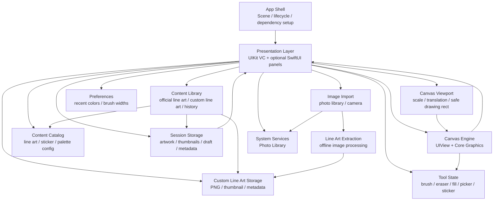
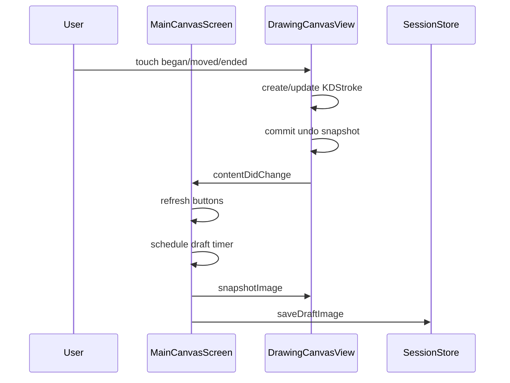
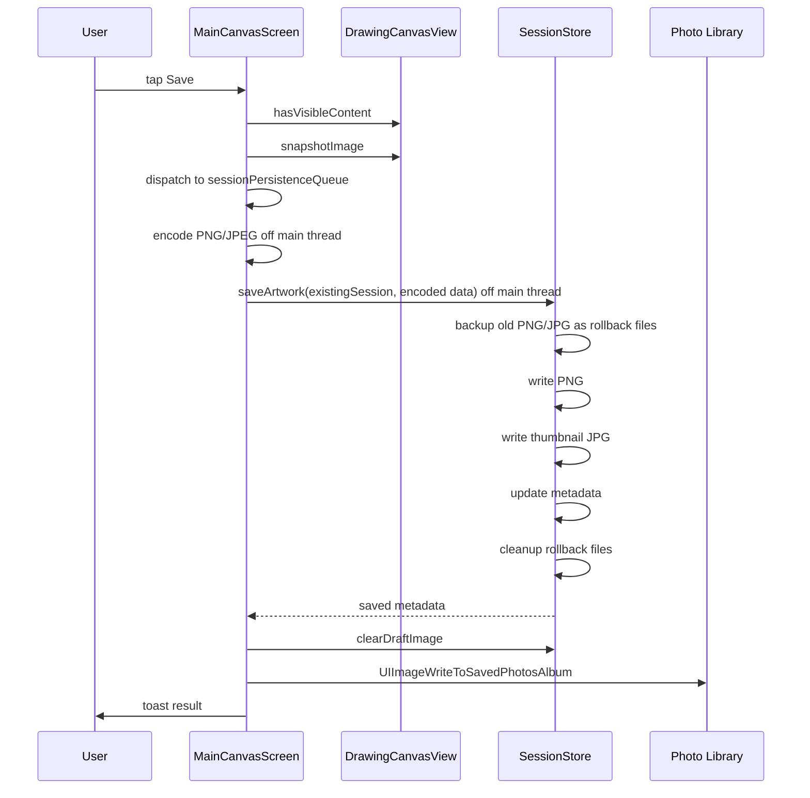
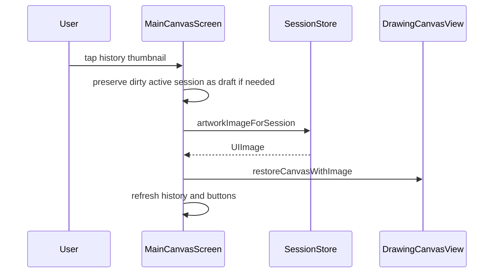

# KidCanvas 技术架构文档

## 1. 架构结论

KidCanvas 的目标架构是 **Swift-first + UIKit/Core Graphics 画布核心 + SPM 模块化**。当前 App target 已无业务 Objective-C `.m` 源码，当前工程已无 `KidCanvas-Bridging-Header.h`；后续重点不再是语言迁移，而是继续收敛模块边界、控制器职责和可测试性。

### 1.1 版本基线与下一阶段方向（2026-07-09）

当前代码基线已封为 `v0.1.0-beta.1`，对应提交 `603980c`。该基线的定位是“可运行、可回滚、可对比”的第一版内测基线，包含 Swift-first 主线、iPhone/iPad 横屏、单页编辑器、绘画工具、线稿、印章、保存/历史、相册导入导出和画笔 dab 基础能力。

产品经理更新后的 `docs/product/prd.md` 是下一阶段需求基线，不应被理解为当前代码已全部实现。下一阶段目标可以归纳为五条主线：

1. 画布导航：安全创作区默认居中、双指缩放、双指平移和恢复默认视图。
2. 内容库：统一承载官方线稿、我的线稿、历史作品和后续导入结果。
3. 我的线稿：把当前画布保存为可复用线稿，并提供独立删除生命周期。
4. 图片导入：把相册导入提升为图片导入服务，补充拍照入口和无相机降级。
5. 图片生成线稿：优先离线图像处理，不上传儿童照片；AI/Core ML 只作为增强候选。

这些能力会影响画布坐标转换、内容入口、持久化模型和验收口径。进入功能开发前必须先完成 T096 的文档对齐，再按 T097-T101 顺序渐进落地。

推荐的长期目标架构是：

```text
Swift app shell
  + Swift UIKit/Core Graphics drawing canvas
  + UIKit App Feature panels
  + local-first session storage
```

也就是说，技术演进方向不是“全部 SwiftUI 化”，而是：

1. 新架构全部采用 Swift 编写。
2. 当前 SPM 落地形态是 1 个本地 package、5 个基础 library target。
3. App target 已按 App / Features / Infrastructure / DesignSystem / Localization / Resources 分层；App Feature 仍在 App target 内，边界稳定后再评估下沉 SPM target。
4. 继续支持 iPhone + iPad，横屏优先。
5. 禁止一个模块一个 package，禁止把画布核心重写为纯 SwiftUI Canvas。
6. 画布核心保持 Swift 编写的 `UIView`/Core Graphics 模块。

## 2. 决策依据

### 2.1 产品特征

KidCanvas 不是常规表单或内容流 App，而是低延迟绘画工具。核心体验依赖：

- 手指和 Apple Pencil 触摸采样。
- 笔触路径实时渲染。
- Core Graphics bitmap 操作。
- flood fill 填色。
- 像素级取色。
- 异形橡皮擦。
- 贴纸多手势操作。
- 撤销重做状态快照。
- 大图导入、快照和本地保存。

这些能力更接近图形编辑器，而不是普通声明式 UI。UIKit/Core Graphics 对触摸事件、绘图生命周期、bitmap context 和 gesture recognizer 的控制更直接。

### 2.2 当前代码状态

当前项目已经具备完整 MVP 雏形并完成 Swift-first 基线：

- `KCMainViewController`：单页 UI、工具栏、历史、保存、导入、线稿、贴纸配置与 App 层协调。
- `KCDrawingCanvasView`：Swift UIKit/Core Graphics 画布，负责绘制、填色、取色、贴纸、撤销重做。
- `KCSessionStore`：作品、缩略图、草稿和 metadata 本地存储。
- `KCAppCompositionRoot`：App 层统一装配会话服务、内容目录和绘制能力。
- `scripts/validate_project.py`：工程结构和功能覆盖校验。
- 正式保存、相册导入仍由 `KCMainViewController` 协调，但正式保存的 PNG/JPEG 编码与本地会话写盘、导入图片归一化都已放入专用后台队列，并通过 generation guard 回主线程提交 UI 收口。

这说明我们不是从零开始设计，而是在演进一个已有产品原型。风险不在于“能不能写出来”，而在于后续拆分过程中如何保住现有行为：

- 绘画手感需要重新调试。
- flood fill、取色、撤销、贴纸手势都需要重新验证。
- SwiftUI 与 UIKit 手势、截图、子视图叠加的边界会增加不确定性。
- 如果在当前阶段强推纯 SwiftUI 画布，迁移成本和体验风险会被叠加放大。

因此，当前执行方式应继续保持 **Swift + UIKit/Core Graphics 画布模式**，而不是一次性把 UI 框架和画布内核同时推翻。

### 2.3 SwiftUI 的适用边界

SwiftUI 适合：

- 工具面板。
- 历史缩略图列表。
- 颜色选择面板。
- 贴纸分类面板。
- 设置页。
- 空状态、权限说明、保存反馈。
- 配置驱动的内容展示。

SwiftUI 不适合作为首版唯一画布核心：

- 对高频触摸和路径采样的控制不如 UIKit 直接。
- 像素级 bitmap 修改仍需要 Core Graphics 或 Metal。
- 贴纸作为可选中、可变换的对象时，UIKit 手势模型更成熟。
- 画布快照、取色、填色和撤销快照仍绕不开底层图像处理。

## 3. 目标架构



目标架构分为七层：

| 层级 | 职责 | 推荐技术 |
| --- | --- | --- |
| App Shell | 启动、Scene 生命周期、依赖装配 | Swift |
| Presentation | 单页界面、面板、按钮状态、用户流程 | SwiftUI + UIKit host |
| Canvas Engine | 笔触、填色、取色、贴纸、撤销重做 | Swift `UIView` + Core Graphics |
| Canvas Viewport | 缩放、平移、安全创作区、坐标转换 | Swift model + UIKit gestures |
| Tool State | 当前工具、颜色、尺寸、画笔样式、贴纸选择 | Swift model |
| Content Library | 官方线稿、我的线稿、历史作品、导入结果入口 | App Feature + Domain model |
| Content Catalog | 线稿、贴纸、色盘、资源配置 | JSON/asset catalog |
| Storage | 作品、缩略图、草稿、历史 metadata、自定义线稿 metadata | FileManager + Codable/JSON |
| Image Import / Extraction | 相册、拍照、离线图片转线稿 | PhotosUI/UIKit + Core Image/Vision fallback |
| System Services | 相册导入导出、相机、权限 | Swift + Photos/UIKit bridge |

## 4. 模块边界

### 4.1 App Shell

当前文件：

- `KidCanvas/App/AppDelegate.swift`
- `KidCanvas/App/SceneDelegate.swift`
- `KidCanvas/App/KCAppCompositionRoot.swift`

职责：

- 创建主 window。
- 设置 root view controller。
- 锁定浅色模式。
- 接入应用生命周期通知。

演进建议：

- 当前由 Swift `AppDelegate` / `SceneDelegate` 接管 UIKit 生命周期。
- 当前阶段继续使用 UIKit lifecycle，不为了形式切换 SwiftUI App lifecycle。
- 后续如引入 SwiftUI 面板，仍由 App CompositionRoot 明确注入依赖。

### 4.2 Presentation Layer

当前核心文件：

- `KidCanvas/Features/Editor/KCMainViewController.swift`
- `KidCanvas/Features/ContentPicker/KCContentPickerFeature.swift`
- `KidCanvas/Features/Editor/KCEditorPanelsFeature.swift`
- `KidCanvas/Features/History/KCHistoryFeature.swift`
- `KidCanvas/Features/LineArt/KCLineArtFeature.swift`
- `KidCanvas/Features/ContentPicker/KCColorPalettePanelRenderer.swift`
- `KidCanvas/Features/Tools/KCBrushStickerPanelView.swift`

职责：

- 创建画布和浮动面板。
- 处理工具切换。
- 同步颜色、尺寸、贴纸、历史状态。
- 调用画布执行操作。
- 调用存储服务保存和恢复。
- 处理历史删除和线稿加载等页面协调；相册导入入口、picker 配置、后台归一化和导入完成回调已拆到 `KidCanvas/Features/Editor/KCMainViewController+ImagePicking.swift`，草稿自动保存、启动草稿恢复、替换前草稿保护和打开草稿已拆到 `KidCanvas/Features/Editor/KCMainViewController+DraftAutosave.swift`，Debug 运行时验收探针已拆到 `KidCanvas/Features/Editor/KCMainViewController+RuntimeAcceptance.swift`，正式保存、保存 generation guard 与相册 best-effort 导出已拆到 `KidCanvas/Features/Editor/KCMainViewController+SessionSaving.swift`。导入大图的方向归一化与尺寸压缩必须走 `imageImportProcessingQueue`，不能在 picker 回调主线程同步处理。

当前问题：

- 主控制器职责已经通过多组 App Feature 与 extension 收敛，但仍承担历史删除和线稿加载等高风险流程协调。
- App 层文件已按职责目录分组，后续重点是继续拆薄 `KCMainViewController`，再评估稳定 Feature 是否下沉为 SPM target。

建议拆分：

```text
MainCanvasScreen
  TopBarView
  ToolRailView
  ColorPanelView
  SizePanelView
  StickerPanelView
  HistoryPanelView
  LineArtPickerView
```

SwiftUI 可作为后续候选承接：

- `ColorPanel`
- `StickerPanel`
- `HistoryPanel`
- `LineArtPicker`
- `SaveToast`
- `EmptyState`
- `PermissionPrompt`

不建议第一批迁移：

- 主画布容器。
- 涉及复杂手势冲突的贴纸编辑区域。
- 与画布快照直接耦合的操作。

### 4.3 Canvas Engine

当前核心文件：

- `KidCanvas/Features/Canvas/KCDrawingCanvasView.swift`
- `KidCanvas/Infrastructure/KCDrawingEngineAdapter.swift`
- `Packages/KidCanvasModules/Sources/KCDrawingEngine/`
- `Packages/KidCanvasModules/Sources/KCDomain/`

职责：

- 管理画布内部状态。
- 接收触摸事件。
- 渲染笔触、背景图和贴纸。
- 实现填色和取色。
- 实现撤销重做。
- 暴露快照、恢复、清空等 API。

建议保持为独立引擎，避免 UI 面板直接改内部数组。

推荐 API 形态：

```text
CanvasEngine
  setTool(...)
  setColor(...)
  setLineWidth(...)
  loadBackgroundImage(...)
  loadLineArt(...)
  insertSticker(...)
  undo()
  redo()
  clear()
  snapshot()
  restoreSnapshot(...)
```

演进方向：

- 当前画布已经是 Swift `UIView`，继续保持 Core Graphics/bitmap 实现，不强行改成 SwiftUI `Canvas`。
- stroke、sticker、canvas state 继续向 Swift value types 和 KCDomain 语义收敛。
- flood fill、取色、线稿几何、蜡笔纹理等算法继续沉入 `KCDrawingEngine` 并补单测。
- 如果后续引入 SwiftUI 面板，只通过状态、action 或协议与画布交互，不直接操纵底层绘图细节。

下一阶段画布导航边界（T097，已完成）：

- 新增 viewport 状态时，必须把屏幕坐标到画布坐标的转换集中在画布或画布协调层，绘制、填色、取色和印章命中不得各自重复换算。当前实现：`KCDomain.KCCanvasViewportState` 提供纯逻辑转换（`canvasPoint(forViewPoint:)` / `affineTransform`），`KCDrawingCanvasView` 在触摸、填色、取色、印章命中入口统一调用。
- 双指缩放/平移只改变 viewport，不改变作品像素数据、历史存储格式或已保存作品尺寸。`UIPinchGestureRecognizer` + 双指 `UIPanGestureRecognizer` 挂在画布 view；单指与 Apple Pencil 仍走绘制 touch pipeline，落在印章上的双指手势让位给印章自身手势。
- 默认居中必须基于安全创作区，而不是整屏几何中心。`KCMainViewController.canvasCreationRect()` 按系统安全区 + 可见浮动面板并集计算创作区，注入画布 viewport 作为默认居中锚点与平移钳制边界。
- 恢复视图按钮仅在 `KCCanvasViewportState.isDefault == false` 时显示，不新增“缩放模式 / 平移模式”按钮。
- MVP 不要求把 viewport 持久化进历史作品；当前会话内可保留，新建/打开历史/清空/线稿载入时重置为默认视图。详见 `docs/modules/KCCanvasViewportState.md`。

画布视觉分层边界（T105，已完成）：

- 主编辑器不再以整屏纯白作为唯一背景。`KCMainViewController` 的画布容器和 `KCDrawingCanvasView` 的屏幕绘制层使用低干扰浅色工作台背景，白色内容平面作为“纸张”绘制，并增加轻投影与描边。
- 纸张边界属于屏幕呈现层，只在 `KCDrawingCanvasView.draw(_:)` 中绘制；`snapshotImage()`、历史缩略图、草稿、保存图片仍走内容坐标空间的白底作品渲染，不写入投影、描边和工作台背景。
- 视觉分层不得改变 `KCCanvasViewportState.contentSize`、笔画坐标、贴纸坐标、历史 schema 或导出尺寸。

放大状态平移验收边界（T106，已完成）：

- `handleCanvasTwoFingerPan(_:)` 与 Debug 运行时验收共用 `applyCanvasViewportTranslation(_:)`，保证自动验收覆盖真实平移路径。
- `canvas-viewport` 探针在 200% 缩放下施加双指 pan 增量，断言 `translation` 改变、同一屏幕点对应的内容点改变且方向符合“内容跟手”预期。
- 平移验收仍与填色/取色同点一致性放在同一探针内，防止只修视觉移动却破坏内容坐标转换。

缩小态平移钳制边界（T107，已完成）：

- 缩小态（scale < 1.0，缩放后内容小于安全创作区）也必须允许双指拖拽移动画纸，不能强制吸回安全创作区中心。修复点在 `KCCanvasViewportState` 单轴钳制原语：内容小于创作区时，平移范围从“单一居中点”改为 `[viewportMin, viewportMax - 内容尺寸]`，画纸完全留在安全创作区内、可在区内任意滑动但不移出创作区/不压到工具轨（人工反馈：早期“重叠钳制”范围太大，已收紧为完全在内）；内容大于等于创作区时的“覆盖创作区”钳制不变。
- 默认居中策略不受影响：`defaultState` / `resettingToDefault()` 仍直接给出“内容中心对齐安全创作区中心”的平移量，不经缩小态钳制分支；恢复视图、新建、打开历史、导入图片、加载线稿仍回到默认居中。
- `canvas-viewport` 探针在 200% 放大态断言之外，新增 50% 缩小态断言：`scaledDownScaleAfterSet < 1.0`、`scaledDownViewportTranslationChanged == true`、`scaledDownContentPointChangedAfterPan == true`、`scaledDownNotCentered == true`（缩小态平移未被吸回中心）。

### 4.3.1 Content Library / Line Art 系统

PRD 已把线稿从“官方线稿弹窗”升级为“官方线稿 + 我的线稿 + 照片生成线稿”的内容体系。按以下边界实现：

- `KCContentCatalog` 继续只负责官方内容元数据，不负责用户生成内容。
- `KCContentLibraryFeature`（T098 已落地，T102 收口）为 App 层内容库按需浮层入口，组合官方线稿、我的线稿和历史作品；不直接读写会话文件、不生成线稿、不持有系统 picker。顶栏右收敛为「内容库 / 导入 / 保存」；线稿弹窗并入官方线稿分区（内嵌 `KCLineArtPickerViewController`）；历史面板从右侧常驻 `rightStack` 迁入历史分区。T102 收口：主分区顺序固定（官方线稿 → 我的线稿 → 历史作品）、`.imports` 为预留分区不进 `defaultOrder`、各分区空态走本地化、历史按 `modifiedAt` 倒序、iPhone/iPad 均用可关闭覆盖层且恢复视图按钮位置稳定。详见 `docs/modules/KCContentLibraryFeature.md`。
- `KCCustomLineArt` / `KCCustomLineArtStore`（T099 已落地）为我的线稿生命周期，独立于历史作品（独立目录 `KidCanvasCustomLineArt/`）；删除我的线稿不得影响已保存历史作品。自动命名走稳定 `sequenceNumber`（App 层本地化“我的线稿 N”），软上限 50；保存为线稿经 `strokeCount` 校验 + `lineArtImage()` 线稿化（黑色笔画白底，排除填色/印章）。详见 `docs/modules/KCCustomLineArtStore.md`。
- `KCImageImportService`（T100 已落地）统一相册与拍照导入：`KCDomain.KCImageImportDecision`（UIKit-free 决策：来源+可用性+授权 → 出示/请求权限/拒绝提示/无相机降级）+ App 适配（`PHPhotoLibrary`/`AVCaptureDevice` 权限）。顶栏与内容库入口复用同一服务与动作表；权限拒绝/无相机/失败均有本地化反馈，不只显示系统错误。“生成线稿”后续分支留 T101。
- 图片生成线稿（T101 已落地）离线 pipeline：`KCLineArtExtractor`（Core Image 灰度→降噪→边缘→反相→高对比阈值化→白底位图，ImageIO 编码）+ 输入亮度均值/标准差质量评估（good/marginal/poor）。结果确认流（使用/重新生成/取消，poor 强制重选）后复用 T099 我的线稿存储（`.photoExtraction`）。能力边界：卡通/白底/简单实物优先，复杂照片给“可能不理想”反馈。不上云、不上传图片。详见 `docs/modules/KCLineArtExtraction.md`。
- AI/Core ML 不是 T101 MVP 的前置条件；只有离线图像处理无法达到产品目标时再进入增强评估。

### 4.4 Tool State

当前状态分散在：

- `KCMainViewController`
- `KCDrawingCanvasView`
- `NSUserDefaults`

建议抽象为单独模型：

```text
DrawingToolState
  currentTool
  currentColor
  currentBrushStyle
  brushWidthsByStyle
  eraserShape
  eraserWidth
  currentSticker
  fillTolerance
```

收益：

- UI 面板和画布之间不再互相了解太多细节。
- SwiftUI 面板可以观察同一份状态。
- 设置持久化更清晰。

这是 Swift 重写时最优先抽离的状态层，否则 SwiftUI 与 UIKit 之间会出现双向同步混乱。

### 4.5 Content Catalog

当前内容来源：

- 色盘：代码数组。
- 贴纸：代码中的 SF Symbols 列表。
- 线稿：代码中的 drawing block。

建议演进为配置驱动：

```text
Resources/
  palettes.json
  stickers.json
  line-art.json
  LineArt/
    animal_cat.pdf
    vehicle_bus.pdf
  Stickers/
    star.pdf
    flower.pdf
```

配置字段示例：

```json
{
  "id": "decor.star",
  "category": "decor",
  "title": "Star",
  "symbolName": "star.fill",
  "assetName": null
}
```

收益：

- 内容扩展不需要改主控制器。
- 设计和运营可独立维护资源包。
- 后续可以支持主题包和版本迁移。

### 4.6 Storage Layer

当前核心文件：

- `Packages/KidCanvasModules/Sources/KCSessionPersistence/KCSessionStore.swift`
- `Packages/KidCanvasModules/Sources/KCDomain/KCArtworkSession.swift`
- `KidCanvas/Infrastructure/KCSessionService.swift`

当前结构：

```text
Documents/
  KidCanvasSessions/
    sessions.archive
    draft.png
    <session-id>.png
    <session-id>-thumb.jpg
```

职责：

- 保存 PNG 原图。
- 保存 JPEG 缩略图。
- 保存历史 metadata。
- 保存和恢复 draft。
- 删除历史作品。

迁移建议：

- 保留当前文件目录语义，但改写为 Swift 实现。
- metadata 从 `NSKeyedArchiver` 迁到 JSON/Codable。
- 增加 schema version。
- 保留保存失败回滚策略；更新已有作品时使用同目录临时文件做文件级备份与恢复，禁止为了回滚把旧 PNG/JPEG 全量读入内存。
- 为旧版本 archive 预留一次性迁移逻辑。

```json
{
  "schemaVersion": 1,
  "sessions": []
}
```

### 4.7 System Services

系统能力包括：

- Photo Library import。
- Save to Photos。
- App lifecycle draft save。
- UserDefaults preferences。

建议封装：

```text
PhotoLibraryService
DraftAutosaveCoordinator
PreferencesStore
```

收益：

- 控制器代码变薄。
- 权限失败和错误反馈集中处理。
- 更容易写单元测试或 smoke tests。

## 5. 核心数据流

### 5.1 绘制数据流



### 5.2 保存数据流



### 5.3 打开历史数据流



## 6. Swift/SwiftUI 演进策略

### 6.1 不推荐路线：纯 SwiftUI 重写

不建议把“弃用 OC”直接翻译成“纯 SwiftUI 重写”，原因：

- 需要同时重做已存在的绘画核心和 UI 组织方式。
- SwiftUI 对高频触摸和 bitmap 编辑不是主要优势区。
- 画布、贴纸、取色、填色、快照这些能力最终仍会落回 UIKit/Core Graphics 或更底层图形能力。
- 容易产生“语言换了，框架换了，但绘画体验退步”的结果。

### 6.2 推荐路线：Swift-first 重写

#### 阶段 A：建立 Swift 骨架

技术栈：

```text
Swift app shell
SwiftUI screen shell
UIKit placeholder canvas
```

目标：

- 新建 Swift 工程骨架或在现工程中接管主入口。
- 建立 Swift 的状态模型、服务层、资源配置结构。
- 让 Swift 工程具备最小可运行主界面。

#### 阶段 B：基础服务继续模块化

技术栈：

```text
Swift models/services
SPM local targets
UIKit App coordination
```

优先演进：

- `KCArtworkSession` / `KCSessionStore` API 继续收敛为稳定 public 边界
- recent colors / brush widths preferences
- palette / sticker / line art catalog
- draft autosave coordinator

#### 阶段 C：画布核心继续拆分算法

技术栈：

```text
Swift UIView canvas
Core Graphics
SwiftUI host
```

目标：

- 继续保持 `KCDrawingCanvasView` 为 Swift UIKit/Core Graphics 画布。
- 保留触摸采样、压力、贴纸手势、填色、取色、撤销重做能力。
- 用协议、action 或 view data 向外围面板暴露事件。

#### 阶段 D：替换外围界面

技术栈：

```text
SwiftUI panels
Swift canvas bridge
```

适合重写：

- 历史面板。
- 贴纸面板。
- 颜色面板。
- 线稿选择面板。
- 保存反馈和空状态。

#### 阶段 E：移除 Objective-C 主线

目标：

- Objective-C 文件不再参与主流程运行。
- 旧实现仅保留在迁移分支或归档目录中作对照。
- 构建、测试和发布流程完全切换到 Swift 主线。

#### 阶段 F：高级图形引擎

仅当产品复杂度明显上升时考虑：

- 多图层。
- 大画布缩放平移。
- 高级笔刷。
- GPU 加速。

可评估：

- Metal。
- PencilKit 局部能力。
- 自研 tile-based bitmap engine。

## 7. 代码组织建议

中期目录建议：

```text
KidCanvas/
  App/
    KidCanvasApp.swift
    AppCoordinator.swift
  Presentation/
    MainCanvasScreen/
    Panels/
      ColorPanel/
      SizePanel/
      StickerPanel/
      HistoryPanel/
      LineArtPicker/
  Canvas/
    DrawingCanvasView.swift
    DrawingCanvasBridge.swift
    Stroke.swift
    Sticker.swift
    CanvasState.swift
    FloodFillEngine.swift
    ColorSampler.swift
  Domain/
    ToolState.swift
    ArtworkSession.swift
    ContentCatalog.swift
  Infrastructure/
    SessionStore.swift
    PreferencesStore.swift
    PhotoLibraryService.swift
    DraftAutosaveCoordinator.swift
  Resources/
    Assets.xcassets
    palettes.json
    stickers.json
    line-art.json
```

如果采用分阶段迁移，也建议新 Swift 文件直接按这套结构落位，避免后面再搬一次家。

## 8. 状态管理原则

### 8.1 单一事实来源

当前工具状态应有明确归属：

- 画布只关心渲染和交互所需状态。
- 面板只关心展示和用户输入。
- 主控制器或 `ToolState` 负责协调同步。

避免：

- 同一个状态在多个 view 中各存一份。
- UI button 的 selected 状态反向成为业务状态来源。

### 8.2 操作命令化

后续可将画布操作抽象为 command：

```text
DrawStrokeCommand
FillRegionCommand
InsertStickerCommand
TransformStickerCommand
DeleteStickerCommand
LoadBackgroundCommand
ClearCanvasCommand
```

收益：

- 撤销重做更清晰。
- 更容易做历史记录压缩。
- 更容易支持多图层和局部重绘。

MVP 阶段继续使用快照栈即可。

## 9. 性能架构

### 9.1 当前策略

- `drawRect` 绘制背景图和笔触。
- 长按/拖动使用 UIKit touch events。
- flood fill 使用 bitmap queue。
- 撤销重做使用最多 48 个状态快照。
- 缩略图固定为 240x180。

### 9.2 风险点

- 笔触数量增长后，`drawRect` 每次重绘所有 stroke 会变慢。
- 大图填色在主线程执行可能卡顿。
- undo state 数量增长后仍会带来内存压力；当前已避免快照阶段反复深拷贝已提交笔画路径。
- 贴纸用 view 子节点实现，数量过多时布局和合成成本会上升。

### 9.3 优化路线

优先级从高到低：

1. 将已完成笔触定期栅格化到 backing image。
2. flood fill 放到后台队列，完成后主线程替换 background image。
3. undo state 从完整快照改为 command + checkpoint 混合模式。
4. 历史缩略图异步加载。
5. 大画布场景引入 tile-based backing store。
6. 如果笔刷复杂度显著提升，再评估 Metal。

## 10. 测试架构

### 10.1 当前校验

已有：

- `scripts/validate_project.py`

覆盖：

- plist/json 解析。
- Xcode 工程引用。
- iPad 横屏配置。
- app icon。
- Objective-C 源码结构。
- 关键功能源码覆盖。

### 10.2 建议补充

单元测试：

- flood fill。
- color sampler。
- session store save/delete/rollback。
- preferences serialization。
- content catalog parsing。

UI smoke tests：

- 启动即画布。
- 切换工具。
- 保存后出现历史缩略图。
- 删除历史作品。
- 相册权限拒绝时不崩溃。

手工验收：

- Apple Pencil 压力。
- 不同 iPad 尺寸布局。
- 多次撤销重做稳定性。
- 大图导入、正式保存和填色性能。

## 11. 风险清单

| 风险 | 当前等级 | 处理建议 |
| --- | --- | --- |
| `KCMainViewController` 仍承担高风险流程协调 | 中 | 继续拆低风险表现层，高风险保存/草稿/相册流程先补协议和验收；当前保存编码和相册导入归一化已后台化 |
| flood fill 主线程卡顿 | 低 | 已异步化，继续用运行时验收守住 |
| undo 快照内存增长 | 中 | 已提交笔画快照已改为 append-only 引用共享，降低每次落笔前的 path 深拷贝成本；后续继续演进栅格化与 command/checkpoint |
| 内容硬编码 | 中 | JSON + assets 配置化 |
| 全量 SwiftUI 重写风险 | 高 | 避免一次性重写 |
| 真机签名未配置 | 低 | Xcode 设置 Development Team |

## 12. 最终建议

当前最合理的工程策略：

```text
短期：Swift-first 重写主线
中期：Swift UIKit canvas + SwiftUI panels
长期：纯 Swift 主线，Objective-C 退出运行链路
```

判断标准很简单：凡是和 **低延迟绘画、像素处理、手势编辑、快照保存** 强相关的能力，放在 Swift 编写的 UIKit/Core Graphics 画布核心；凡是和 **面板展示、配置选择、列表管理、设置状态** 强相关的能力，放在 SwiftUI。

这样既能彻底摆脱 Objective-C，又能避免把画布核心错误地塞进纯 SwiftUI。
